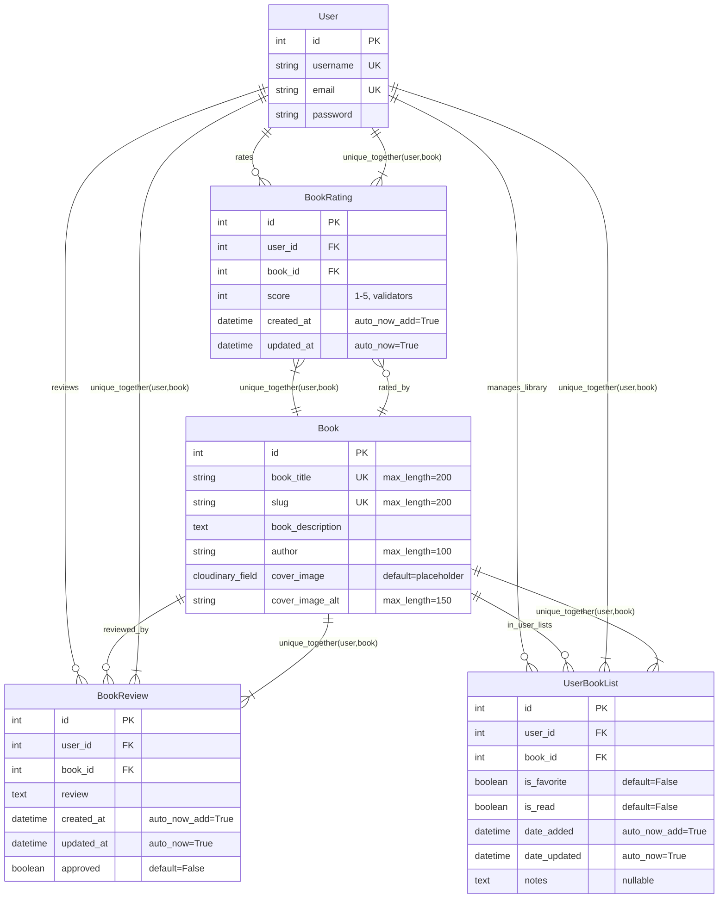

# Entity Relationship Diagram (ERD) - Ink & Read Project

## Database Schema Overview

This ERD represents the complete database structure for the Ink & Read Django project, showing all models and their relationships.

## Model Descriptions

### User (Django's Built-in)
- **Purpose**: Manages user authentication and basic profile information
- **Key Features**: Username, email, authentication fields
- **Relationships**: Central entity connected to all user-generated content

### Book
- **Purpose**: Stores book information including metadata and cover images
- **Key Features**: 
  - Unique title and slug for SEO-friendly URLs
  - Cloudinary integration for cover image storage
  - Author information and rich text descriptions
- **Methods**: `average_rating()`, `is_favorited_by()`, `is_read_by()`

### BookRating
- **Purpose**: Stores user ratings for books (1-5 stars)
- **Key Features**:
  - One rating per user per book (unique constraint)
  - Timestamp tracking for creation and updates
  - Validation for score range (1-5)
- **Related Name**: `ratings` (accessible via `book.ratings.all()`)

### BookReview
- **Purpose**: Stores detailed user reviews for books
- **Key Features**:
  - One review per user per book (unique constraint)
  - Admin approval system with `approved` flag
  - Rich text content support
- **Related Names**: `reviewer` (user), `reviewed_book` (book)

### UserBookList
- **Purpose**: Manages user's personal book library and reading status
- **Key Features**:
  - Favorite and read status tracking
  - Personal notes for each book
  - Timestamp tracking for library management
- **Related Names**: `book_lists` (user), `user_lists` (book)

## Key Relationships

1. **One-to-Many Relationships**:
   - User → BookRating (One user can rate many books)
   - User → BookReview (One user can review many books)
   - User → UserBookList (One user can have many books in library)
   - Book → BookRating (One book can have many ratings)
   - Book → BookReview (One book can have many reviews)
   - Book → UserBookList (One book can be in many user libraries)

2. **Unique Constraints**:
   - (User, Book) in BookRating: One rating per user per book
   - (User, Book) in BookReview: One review per user per book
   - (User, Book) in UserBookList: One library entry per user per book

## Database Indexes

- **Primary Keys**: Auto-generated `id` fields on all models
- **Unique Keys**: `book_title`, `slug` on Book; `username`, `email` on User
- **Foreign Keys**: All relationship fields create database indexes
- **Compound Indexes**: Unique constraints create compound indexes

## Business Logic Notes

- **Average Rating Calculation**: Computed dynamically via `Book.average_rating()` method
- **User Library Status**: Managed through boolean flags in `UserBookList`
- **Review Moderation**: Reviews require admin approval before display
- **Cascading Deletes**: User deletion removes all associated ratings, reviews, and library entries
- **Image Storage**: Cover images stored in Cloudinary with HTTPS enforcement