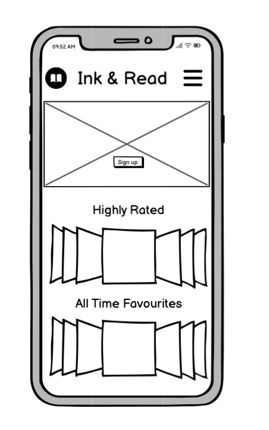
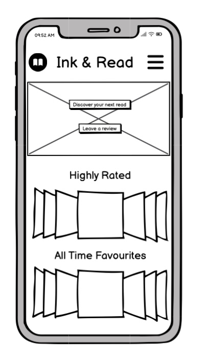
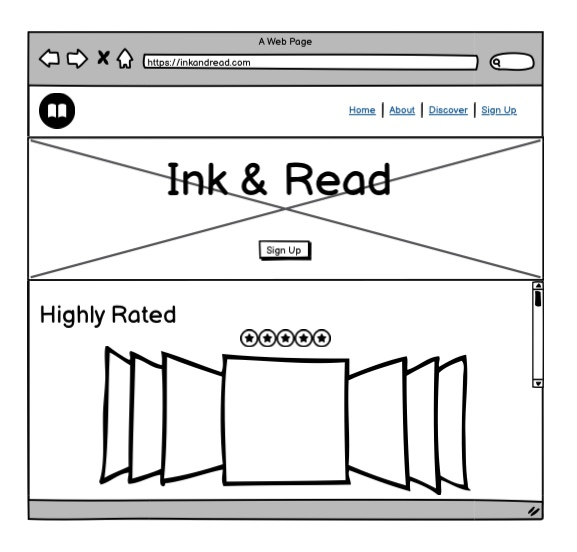
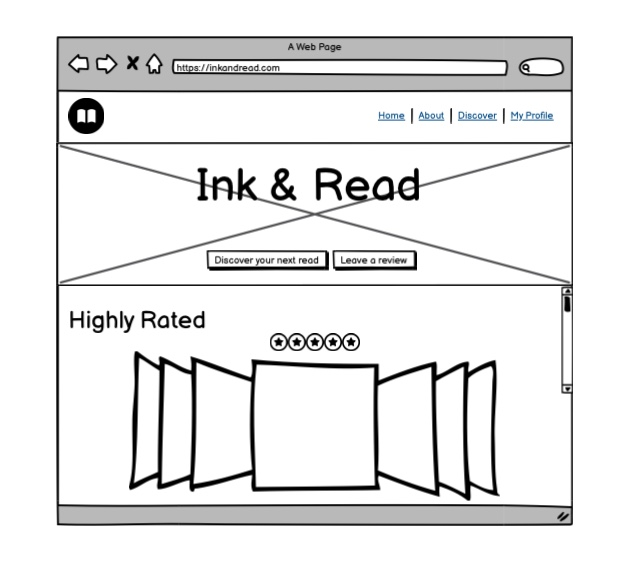
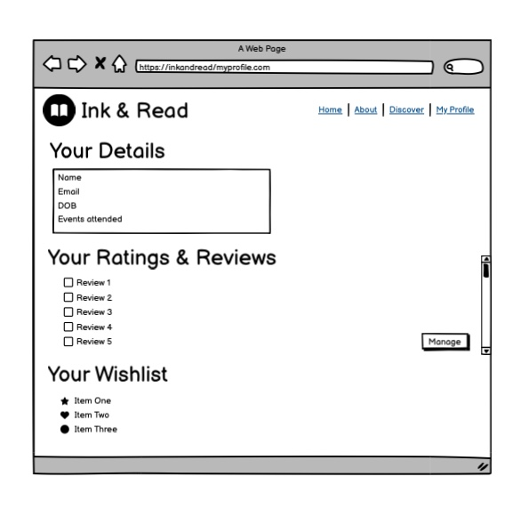
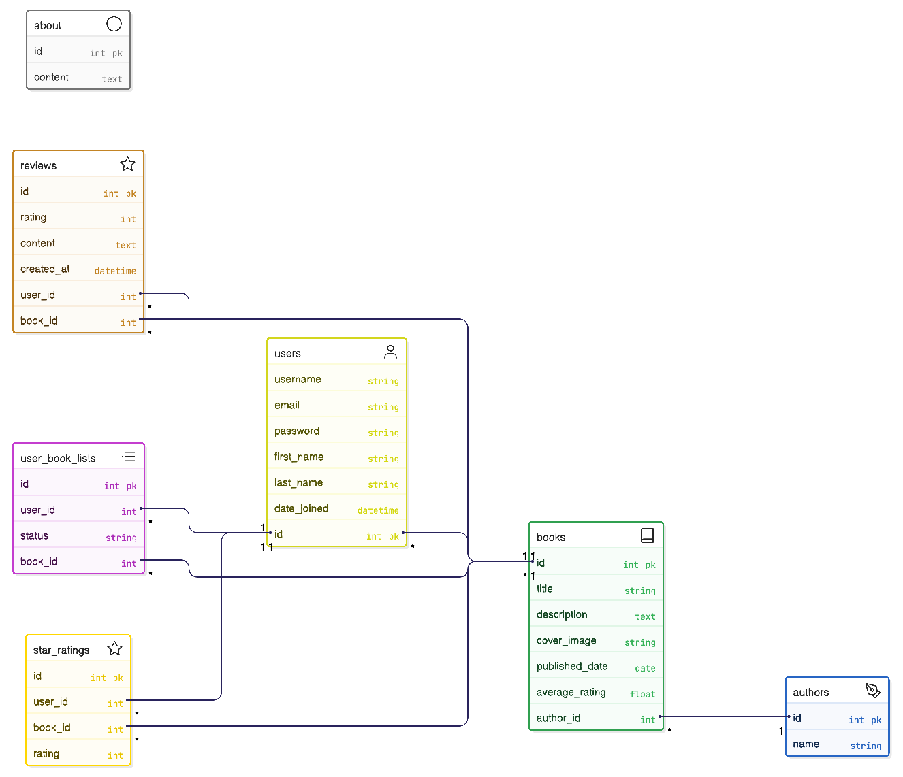

## Table Of Contents:
1. [About](#about)
2. [Design & Planning](#design-&-planning)
    * [User Stories](#user-stories)
    * [User Goals](#user-goals)
    * [Wireframes](#wireframes)
    * [Agile Methodology](#agile-methodology)
    * [Typography](#typography)
    * [Colour Scheme](#colour-scheme)
    * [Database Diagram](#database-diagram)
    * [Entity Relationship Diagram Diagram](#entity-relationship-diagram)    
    
3. [Features](#features)
    * [Navigation](#Navigation)
    * [Footer](#Footer)
    * [Home page](#Home-page)
    * [add your pages](#)
    * [CRUD](#CRUD)
    * [Authentication & Authorisation](#Authentication-Authorisation )

4. [Technologies Used](#technologies-used)
5. [Libraries](#libraries-used)
6. [Testing](#testing)
7. [Bugs](#bugs)
8. [Deployment](#deployment)
9. [Credits](#credits)

## About
[Back To The Top](#table-of-contents)

Ink&Read is a website for avid readers to be part of a vibrant community of readers. The members can view books available on the website, learn more about each book and see what the community members are rating it. Members of the community can also submit their reviews for books, whilst non-members have view-only access to the ratings and reviews.

Admins can upload new books, approve reviews and create content for each book page, including details about the book (and author). Admins can also create content for the About page of the website.

Members of the websites can also create a wishlist for books they'd like to read. In the member profile page, logged in users can view and manage their ratings and reviews, as well as view their wishlist.

## Design & Planning:
[Back To The Top](#table-of-contents)

### User Stories
Write your user stories in this section

  

  
GitHub Project User Stories

  
  
  

### User Goals

### Site Owner Goals
- Display a website with information on books
- Manage ratings and reviews for books
- Manage the About page
- Manage a list of highly rated books
- Create a responsive and intuitive design

### External Registered User Goals
- Read detailed book information
- Register for an account
- Log in securely
- Edit saved user details
- Submit reviews on books
- Edit and delete reviews
- Rate books using a star rating system
- Enquire/register for upcoming book events

### External Non-Registered User Goals
- Read detailed book information
- View reviews on books
- View ratings on books

### Wireframes

I  used [Balsamiq](https://balsamiq.com/) to make wireframes for different screen layouts for my website design, and created mockups for mobile screen and laptop/desktop screen users. The wireframes helped to create an initial vision of how the website would look and feel. The finished website took inspiration from the mockups and built on top of it, hence the final result may differ from the wireframes  constructed in the initial planning stages.

#### Mobile Wireframes

  

  
Home Page - Not Logged In

  
  
  

  

  
Home Page - Logged In

  
  
  

#### Laptop/Desktop Wireframes

  

  
Home Page - Not Logged In

  
  
  

  

  
Home Page - Logged In

  
  
  

   

  
My Profile - Logged In

  
  
  

  

### Agile Methodology
Explain your agile approach to your project and insert screenshoots of your Kanban board (itterations, user stories, tasks,acceptance criteria, labels, story points...)

The agile approach for my project was to create a kanban board to track the status of the issues for the project. Each issue was prioritised using the MoSCow labels (Must Have, Should Have, Could Have) to streamline the issues, and focus on completing the issues with higher priority first. Each issue correlated to a user story, with an acceptance criteria list of what it would require for each user story to be considered complete. 

The Kanban board was structured into three different stages:

- To Do
- In Progress
- Done

Link to the project [Kanban Board](https://github.com/users/GurpritK/projects/9/views/1) 

### Typography
Explain font you've used for your project
### Colour Scheme
Screenshoot of the colour scheme for your project
### DataBase Diagram
Image of the database diagram for your project, you can name your database models as well and how they are connected

### Entity Relationship Diagram
I used [Eraser](https://www.eraser.io/ai/erd-generator) to create an Entity Relationship Diagram (ERD). The relationships between the tables are drawn. The About table is completely independent (they have no connection to any other table). A picture of the ERD is below.

  
Entity Relationship Diagram

  
  
  

## Features:
[Back To The Top](#table-of-contents)

Explain your features on the website,(navigation, pages, links, forms, input fields, CRUD....)
### Navigation
### Footer
### Home-page
### CRUD
### Authentication-Authorisation 
## Technologies Used
[Back To The Top](#table-of-contents)

Used Gemini AI to generate hero image used on website homepage.

List of technologies used for your project
## Testing
[Back To The Top](#table-of-contents)

Important part of your README!!!
### Google's Lighthouse Performance
Screenshots of certain pages and scores (mobile and desktop)
### Browser Compatibility
Check compatability with different browsers
### Responsiveness
Screenshots of the responsivness, pick few devices
### Code Validation
Validate your code HTML, CSS, JS & Python (all pages/files need to be validated!!!), display screenshots
### Manual Testing user stories
Test all your user stories, you an create table 
User Story |  Test | Pass
--- | --- | :---:
paste here you user story | what is visible to the user and what action they should perform | &check;
attach screenshot

### Manual Testing
The site was tested on the following browsers for compatibility:

### Chrome ###
|   Test	|  Expected Result 	|  Actual Result	|
|---	|---	|---	|
|   Click Home menu	|  success 	|  success 	|
|   Click About menu	|  success 	|  success 	|
|   Click Biogs menu	|  success 	|  success 	|
|   Click Admin menu	|  success 	|  success 	|
|   Click Login menu	|  success 	|  success 	|
|   Click Logout	|  success 	|  success 	|
|   Click individual blog post	|  success 	|  success 	|
|   Create, edit, delete a personal comment	|  success 	|  success 	|
|   Register new account	|  success 	|  success 	|
|   Create collaboration request	|  success 	|  success 	|
|   Access admin interface	|  success 	|  success 	|
|   Responsivity	|  success 	|  success 	|
|   Open new page from social media links	|  success 	|  success 	|

### Firefox ###
|   Test	|  Expected Result 	|  Actual Result	|
|---	|---	|---	|
|   Click Home menu	|  success 	|  success 	|
|   Click About menu	|  success 	|  success 	|
|   Click Biogs menu	|  success 	|  success 	|
|   Click Admin menu	|  success 	|  success 	|
|   Click Login menu	|  success 	|  success 	|
|   Click Logout	|  success 	|  success 	|
|   Click individual blog post	|  success 	|  success 	|
|   Create, edit, delete a personal comment	|  success 	|  success 	|
|   Register new account	|  success 	|  success 	|
|   Create collaboration request	|  success 	|  success 	|
|   Access admin interface	|  success 	|  success 	|
|   Responsivity	|  success 	|  success 	|
|   Open new page from social media links	|  success 	|  success 	|

### Edge ###
|   Test	|  Expected Result 	|  Actual Result	|
|---	|---	|---	|
|   Click Home menu	|  success 	|  success 	|
|   Click About menu	|  success 	|  success 	|
|   Click Biogs menu	|  success 	|  success 	|
|   Click Admin menu	|  success 	|  success 	|
|   Click Login menu	|  success 	|  success 	|
|   Click Logout	|  success 	|  success 	|
|   Click individual blog post	|  success 	|  success 	|
|   Create, edit, delete a personal comment	|  success 	|  success 	|
|   Register new account	|  success 	|  success 	|
|   Create collaboration request	|  success 	|  success 	|
|   Access admin interface	|  success 	|  success 	|
|   Responsivity	|  success 	|  success 	|
|   Open new page from social media links	|  success 	|  success 	|

### Safari ###
|   Test	|  Expected Result 	|  Actual Result	|
|---	|---	|---	|
|   Click Home menu	|  success 	|  success 	|
|   Click About menu	|  success 	|  success 	|
|   Click Biogs menu	|  success 	|  success 	|
|   Click Admin menu	|  success 	|  success 	|
|   Click Login menu	|  success 	|  success 	|
|   Click Logout	|  success 	|  success 	|
|   Click individual blog post	|  success 	|  success 	|
|   Create, edit, delete a personal comment	|  success 	|  success 	|
|   Register new account	|  success 	|  success 	|
|   Create collaboration request	|  success 	|  success 	|
|   Access admin interface	|  success 	|  success 	|
|   Responsivity	|  success 	|  success 	|
|   Open new page from social media links	|  success 	|  success 	|

### Lighthouse
The site was tested using Lighthouse with the following results:

### Responsive Testing

Alongside the built in Bootstrap responsive CSS, Chrome dev tools were used frequently to test the site at standard screen sizes and the site was manually viewed on laptops, tablets and phones.

### Validator Testing

- HTML

  - No errors were returned when passing through the official W3C validator

- CSS
  - No errors were found with our own CSS code when passing through the official Jigsaw validator.

- Python

  - All Python code was tested for PEP8 compatibility with the Code Institute Linter.

  **The only code that didn't pass was code that was automatically generated by Django**
  
  which was then edited in order to pass.

  

  - Javascript

  - All Javascript code was tested for errors with JSHint. There were no code errors and one error related to imported code, which is outside the domain of the test.
  
  

## Bugs
[Back To The Top](#table-of-contents)

List of bugs and how did you fix them

## Deployment
[Back To The Top](#table-of-contents)

This website is deployed to Heroku from a GitHub repository, the following steps were taken:

#### Creating Repository on GitHub
- First make sure you are signed into [Github](https://github.com/) and go to the code institutes template, which can be found [here](https://github.com/Code-Institute-Org/gitpod-full-template).
- Then click on **use this template** and select **Create a new repository** from the drop-down. Enter the name for the repository and click **Create repository from template**.
- Once the repository was created, I clicked the green **gitpod** button to create a workspace in gitpod so that I could write the code for the site.

#### Creating an app on Heroku
- After creating the repository on GitHub, head over to [heroku](https://www.heroku.com/) and sign in.
- On the home page, click **New** and **Create new app** from the drop down.
- Give the app a name(this must be unique) and select a **region** I chose **Europe** as I am in Europe, Then click **Create app**.

#### Create a database 
- Log into [CIdatabase maker](https://www.heroku.com/](https://dbs.ci-dbs.net/))
- add your email address in input field and submit the form
- open database link in your email
- paste dabase URL in your DATABASE_URL variable in env.py file and in Heroku config vars

#### Deploying to Heroku.
- Head back over to [heroku](https://www.heroku.com/) and click on your **app** and then go to the **Settings tab**
- On the **settings page** scroll down to the **config vars** section and enter the **DATABASE_URL** which you will set equal to the elephantSQL URL, create **Secret key** this can be anything,
**CLOUDINARY_URL** this will be set to your cloudinary url and finally **Port** which will be set to 8000.
- Then scroll to the top and go to the **deploy tab** and go down to the **Deployment method** section and select **Github** and then sign into your account.
- Below that in the **search for a repository to connect to** search box enter the name of your repository that you created on **GitHub** and click **connect**
- Once it has been connected scroll down to the **Manual Deploy** and click **Deploy branch** when it has deployed you will see a **view app** button below and this will bring you to your newly deployed app.
- Please note that when deploying manually you will have to deploy after each change you make to your repository.
## Credits
[Back To The Top](#table-of-contents)

* Gemini AI for image generation 
* Eraser.io for ERD 

List of used resources for your website (text, images, snippets of code, projects....)