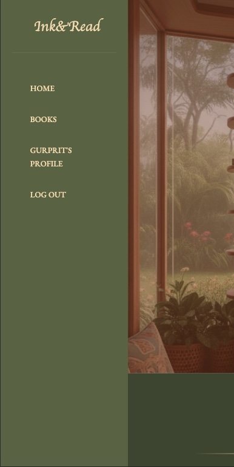
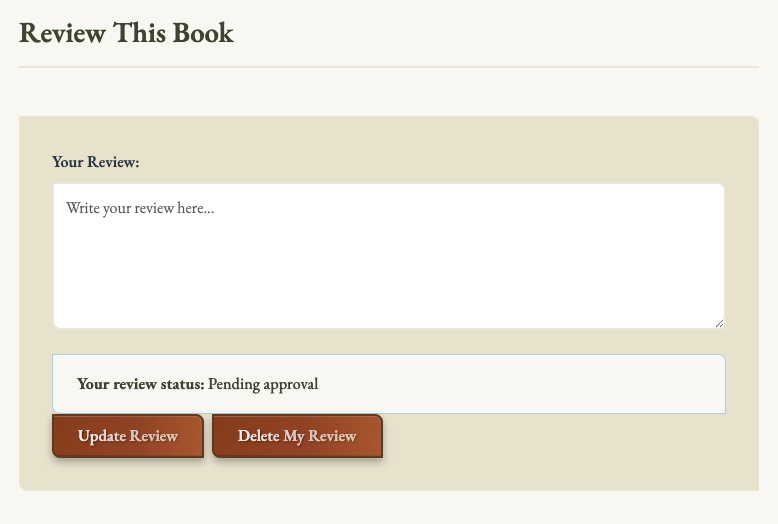
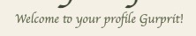

## Table Of Contents:
1. [About](#about)
2. [Design & Planning](#design-&-planning)
    * [User Stories](#user-stories)
    * [User Goals](#user-goals)
    * [Wireframes](#wireframes)
    * [Agile Methodology](#agile-methodology)
    * [Typography](#typography)
    * [Colour Scheme](#colour-scheme)
    * [Entity Relationship Diagram Diagram](#entity-relationship-diagram)    
    
3. [Features](#features)
    * [Navigation](#Navigation)
    * [Footer](#Footer)
    * [Home page](#Home-page)
    * [add your pages](#)
    * [CRUD](#CRUD)
    * [Authentication & Authorisation](#Authentication-Authorisation )

4. [Technologies Used](#technologies-used)
5. [Libraries](#libraries-used)
6. [Testing](#testing)
7. [Bugs](#bugs)
8. [Deployment](#deployment)
8. [AI Reflection](#ai-reflection)
9. [Credits](#credits)

## About
[Back To The Top](#table-of-contents)

Ink&Read is a website for avid readers to be part of a vibrant community of readers. The members can view books available on the website, learn more about each book and see what the community members are rating and reviewing it. Members of the community can also submit their reviews for books, whilst non-members have view-only access to the ratings and reviews.

Admins can upload new books, approve reviews and create content for each book page, including details about the book. 

Members of the website can also create a wishlist for books they'd like to read or mark books as 'read'. In the member profile page, logged in users can view their wishlist and track the books they have read. Users can also see this on each individual book page whether they have previously added the book to their wishlist or marked that book as read. Admins can manage user profile lists, including the 'wishlist' and 'read' list.

## Design & Planning:
[Back To The Top](#table-of-contents)

### User Goals

#### Site Owner Goals
- Display a website with information on books
- Manage ratings and reviews for books
- Manage a list of highly rated books
- Create a responsive and intuitive design

#### External Registered User Goals
- Read detailed book information
- Register for an account
- Log in securely
- Edit saved user details
- Submit reviews on books
- Update and delete reviews
- Rate books using a star rating system

#### External Non-Registered User Goals
- Read detailed book information
- View reviews on books
- View ratings on books
- View the featured book of the week

### User Stories

Link to the project [GitHub Project/User Stories Board](https://github.com/users/GurpritK/projects/9/views/1) 

  

  
GitHub Project User Stories

  
  
  

#### User Stories List
Admin can upload books to site	
View a book page	
Create landing page(s)	
Sign up as a member	
Submit book rating	
Update or delete book rating	
Create search functionality	
Create top rated books list	
Add books to wish-list	
Submit book review	
Update or delete book review	
Admin can approve reviews	
Add user profile details	

### Wireframes

I  used [Balsamiq](https://balsamiq.com/) to make wireframes for different screen layouts for my website design, and create mockups for mobile screen and laptop/desktop screen users. The wireframes helped to create an initial vision of how the website would look and feel. The finished website took inspiration from the mockups and built on top of it, hence the final result may differ from the wireframes constructed in the initial planning stages.

#### Mobile Wireframes

  

  
Home Page - Not Logged In

  
  
  

  

  
Home Page - Logged In

  
  
  

#### Laptop/Desktop Wireframes

  

  
Home Page - Not Logged In

  
  
  

  

  
Home Page - Logged In

  
  
  

   

  
My Profile - Logged In

  
  
  

  

### Agile Methodology
Explain your agile approach to your project and insert screenshoots of your Kanban board (iterations, user stories, tasks,acceptance criteria, labels, story points...)

The agile approach for my project was to create a kanban board to track the status of the issues for the project. Each issue was prioritised using the MoSCow labels (Must Have, Should Have, Could Have) to streamline the issues, and focus on completing the issues with higher priority first. Each issue correlated to a user story, with an acceptance criteria list of what it would require for each user story to be considered complete. 

The Kanban board was structured into three different stages:

- To Do
- In Progress
- Done

Link to the project [Kanban Board](https://github.com/users/GurpritK/projects/9/views/1) 

### Typography

For the logo and main headings of Ink&Read, I chose the Cedarville Cursive font. Its handwritten, flowing style evokes the warmth and personality of classic handwritten notes or vintage book inscriptions, giving the site a touch of literary charm and nostalgia.

For the body text and general content, I selected EB Garamond, a timeless serif typeface known for its elegance, readability, and historical connection to traditional print. Together, these two fonts create a balanced aesthetic — the cursive lends character and creativity, while Garamond ensures clarity and a polished, modern reading experience.

This pairing was carefully chosen after testing several options; the goal was to capture the feeling of an inviting library or cherished personal bookshelf, while maintaining a professional and accessible interface that supports effortless navigation and reading.

### Colour Scheme and Design Choices

I wanted to create a cosy library nook feeling on this virtual website and employed warm neutral tone colours and wooden textures to evoke this. The primary colours used were muted shades of green, and the font colours were muted pale yellow shades and browns. I generated an AI image with prompts to bring my vision to life of a welcoming reading area for a community of readers, creating a cohesive look with the hero image tying the website together.

I shifted the navbar to the left hand side of the page, rather than keep it at the top. By removing the navbar from the top, my aim was to create website which would feel less corporate.

The inspiration colour palette was generated using [Coolors](https://www.coolors.co). However, as I developed and designed the website, I tweaked and experimented with other colours so the website palette may not be an exact palette of the original palette selected. There are still elements of the original palette within the website, but I incorporated more shades of yellows.

  
Colour Palette

  
  
  

### Entity Relationship Diagram
I used [Eraser](https://www.eraser.io/ai/erd-generator) to create an Entity Relationship Diagram (ERD). The relationships between the tables are drawn. 

  
Entity Relationship Diagram

  
  
  

### Model Descriptions

#### User (Django's Built-in)
- **Purpose**: Manages user authentication and basic profile information
- **Key Features**: Username, email, authentication fields
- **Relationships**: Central entity connected to all user-generated content

#### Book
- **Purpose**: Stores book information including metadata and cover images
- **Key Features**: 
  - Unique title and slug for SEO-friendly URLs
  - Cloudinary integration for cover image storage
  - Author information and rich text descriptions
- **Methods**: `average_rating()`, `is_favorited_by()`, `is_read_by()`

#### BookRating
- **Purpose**: Stores user ratings for books (1-5 stars)
- **Key Features**:
  - One rating per user per book (unique constraint)
  - Timestamp tracking for creation and updates
  - Validation for score range (1-5)
- **Related Name**: `ratings` (accessible via `book.ratings.all()`)

#### BookReview
- **Purpose**: Stores detailed user reviews for books
- **Key Features**:
  - One review per user per book (unique constraint)
  - Admin approval system with `approved` flag
  - Rich text content support
- **Related Names**: `reviewer` (user), `reviewed_book` (book)

#### UserBookList
- **Purpose**: Manages user's personal book library and reading status
- **Key Features**:
  - Favorite and read status tracking
  - Personal notes for each book
  - Timestamp tracking for library management

## Features:
[Back To The Top](#table-of-contents)

Screenshots of features below:

### Navigation

For larger screens like laptops and desktops, there is a fixed navbar on the left hand side of the website. The navbar is accessible and visible from all screens:

  
Homepage Navbar

  
  
  

For smaller screens, like mobiles and tablets, there is a fixed navbar the the top of the screen with a hamburger icon for the menu dropdown. This navbar is accessible on all pages:

  
Mobile Navbar

  
  
  

From the navbar, users can navigate to the book collection and their own profiles. If they are logged in, they have the menu option to 'log out'. If they are not signed in, the navbar updates to provide menu options to 'sign up' and 'log in':

  
Smart Navbar

  
  
  

From the book collection page, users can navigate to individual books to read more about each book, as well as add ratings and reviews. Within each book page, the user can also add the book to a 'wishlist' or mark it as 'read'. 

Similarly, users can navigate to books from their own profile from the navbar.

### Footer

In the footer, there are some quick links to the homepage, and the book collection page. There is a small description about the Ink&Read website, and social media links. Currently there are empty links which simply navigate to the hompages of the social media websites. 

  
Footer

  
  
  

### Home-page

The homepage displays a beautiful and inviting hero image which creates a warm, welcoming inviting for readers. Here you have some CTA buttons to 'explore books' or 'sign up' or 'log in':

  
Buttons Logged Out

  
  
  

The 'sign up' and 'log in'  buttons are removed and replaced if the user is logged in to a 'log out' button:

  
Buttons Logged In

  
  
  

Below the hero section, there is more information about the site and everything you can use the site for. This information is split and displayed in a grid for an easier to digest format:

  
About Grid

  
  
  

Near the bottom of the homepage, there is a section for 'book of the week' which updates according to the most recent highly rated book:

  
Featured Book

  
  
  

### Book-collection-page

The book collection page displays all the book included in the website in a grid display. Within each book grid/card, the book cover, book title, a truncated description of the book and author name is visible:

  
Book Collection Grid

  
  
  

Additionally, a rating display for each book is also visible:

  
Individual Book Rating

  
  
  

If a book has no ratings, this is also shown in the book card:

  
Individual Book No Rating

  
  
  

Logic is applied to calculate and display the average rating score for each book in the individual book card. It is possible to click on any book, and navigate to the book details page.

### Book-detail-page

The book detail page is where you can see the full description of each book, book cover and also the other details like author and title:

  
Book Details

  
  
  

On this page, you will find the average rating of a book and reviews left by other users:

  
Book Detail Average Rating

  
  
  

Logged in users can also give a rating and submit a review. If the logged in user has previously submitted either a review or rating, it can also be updated or deleted from this page:

  
Submit Rating or Review

  
  
  

 
The reviews are only displayed after approval:

  
Review Approval Message

  
  
  

On this page, logged in users can add a book to their own wishlist, or mark a book as read:

  
List Buttons

  
  
  

For logged out users, you can see everything linked to the book but cannot add reviews or ratings, or add the book to a wishlist or mark it as 'read'. In the space of where these buttons are available for logged in users, there is instead a message to 'log in' to 'complete action', where the action represents either of those fuctionalities.

  
Limited Functionality

  
  
  

### User-profile-page

Logged in users have their own member area, which they can navigate to directly from the navbar:

  
Profile Area

  
  
  

The link is personalised with the user's name e.g. "Gurprit's Profile":

  
Personalised Message

  
  
  

There is also a number tracker for their lists:

  
List Number Tracker

  
  
  

Within the user profile, members can view their wishlist of books:

  
Wishlist

  
  
  

 
They can also track their reading by viewing books they have marked as 'read':

  
Read List

  
  
  

 
 If there are no books in either list, there is CTA button to 'browse books' so that they can start curating their lists:

 

  
No Books inn List

  
  
  

**Future Improvement:** This profile area can be further improved in the future by allowing users to directly manage their lists from this page. However, they can make changes to their lists by clicking on a book from the profile area, and toggling the 'add to wishlist' or 'mark as read' buttons. This change will automatically update and reflect in the user profile page.

### CRUD

- Registered users can add a rating, update their rating and delete their rating for a book. When the user navigates the book page, they can also view the rating they submitted. When a user makes any of these changes, they are notified with an alert whether their action was successful. Each user is limited to one rating per book, and the option to 'update' their rating is available if a rating has already been submitted.

- Registered users can create reviews, update their reviews and delete their reviews for a book. When the user submits or updates a review, it is sent for approval to the admin. The user is notified that their review has been submitted for approval. When a user deletes their review, this change is applied immediately and the review will no longer be seen on the page. All reviews from all users are visible on the book page. Each user is limited to one review per book, and the option to 'update' their review is available only.

- To personalise the user experience further, registered users can navigate to a book page and 'add to wishlist'. This will add the book to their wishlist in their personal profile page. Users can easily remove a book from their wishlist by toggling the button on the book page. The change is reflected immediately on the book details page and in the user profile page too. The user is notified for each action. This feature is available to logged in users only.

- Similarly, as part of the personalised user experience, registered users can navigate to a book page and mark the book as 'read'. This will add the book to their 'read' books collection in their personal profile section. Users can easily mark the same book as 'unread' by toggling the 'read' button on the book details page. The change is reflected immediately on the book page. The user is notified for each action. This feature is available to logged in users only.

### Authentication-Authorisation 

- Django AllAuth: Django authentication/authorisation pages used for sign up, log in and log out pages. These were customised using the website's design theory. Admins can view and remove users from the admin section. 

## Technologies Used
[Back To The Top](#table-of-contents)

List of technologies used for your project

### Languages

* Python
* Django
* HTML
* CSS
* JavaScript

### Frameworks, Libraries, and Tools

* **Django**: The main web framework used for building the application
* **Bootstrap**: For responsive design and styling
* **AllAuth**: For user authentication
* **Crispy Forms**: For all forms
* **Heroku**: For application deployment
* **Git**: For version control
* **Visual Studio Code** For code development and local testing
* **Cloudinary**: Dynamic assets hosting (images)
* **Favicon.io**: For manifest and favicon creation
* **Balsamiq**: Wireframes creation
* **Fontawesome** Social media icons (Facebook, Instagram, X and Youtube)
* **Google Fonts** Import fonts to CSS

### AI tools
* **Gemini** : AI image generation
* **ChatGPT** : Coding with Django research 
* **Eraser.io** : ERD generation
* **Copilot** : Code development and debugging assistance

## Testing
[Back To The Top](#table-of-contents)

### Testing tools
- [HTML Validator](https://validator.w3.org/nu/) - Used to validate the HTML files.
- [CSS Validator](https://jigsaw.w3.org/css-validator/) - Used to validate the JavaScript code.
- [JShint](https://jshint.com/) - Used to validate the JavaScript code.
- [CI Python Linted](https://pep8ci.herokuapp.com/) - Used to validate Python code.
- Chrome Developer Tools - Lighthouse reports, template responsiveness

### Google's Lighthouse Performance
Screenshots of desktop and mobile lighthouse reports for homepage, books page and profile page.

  
Homepage Desktop Lighthouse Report

  
  
  

  
Homepage Mobile Lighthouse Report

  
  
  

  

  
Book Collection Desktop Lighthouse Report

  
  
  

  
Book Collection Mobile Lighthouse Report

  
  
  

  

  
Profile Page Desktop Lighthouse Report

  
  
  

  
Profile Page Mobile Lighthouse Report

  
  
  

### Browser Compatibility

Compatability check with different browsers

| Browser | Status | 
|:-------:|:--------| 
| Google Chrome | Success |
| Safari | Success |
| Firefox | Success |

### Responsiveness
Responsiveness tested using Chrome Developer Tools, and testing different dimensions.

Screenshots of the responsiveness for mobile, tablet and desktop for the **homepage**:

  
Homepage Desktop Screen

  
  
  

 

  
Homepage Tablet Screen

  
  
  

  
Homepage Mobile Screen

  
  
  

Screenshots of the responsiveness for mobile, tablet and desktop for the **books** page:

  
Books Desktop Screen

  
  
  

 

  
Books Tablet Screen

  
  
  

  
Books Mobile Screen

  
  
  

Screenshots of the responsiveness for mobile, tablet and desktop for the **profile** page:

  
Profile Desktop Screen

  
  
  

 

  
Profile Tablet Screen

  
  
  

  
Profile Mobile Screen

  
  
  

### Code Validation
HTML, CSS, JS & Python Code Validations

  

  
HTML Validation Screenshot

  
  
  

  
CSS Validation Screenshot

  
  
  

Python Validation

Python (PEP8) Validation using [CI Python Linted](https://pep8ci.herokuapp.com/) and Flake8 in local development environment:
All .py files validated with only two python files remaining showing minimal warnings. All other python files in project validated successfully.

Outstanding Warnings:

A specific error for unused env import in settings.py. It's safe to leave it as it, and it doesn't impact the functionality.

There are still minor warnings related to line too long (greater than 79 characters) in models.py and settings.py, but these do not affect the functionality of the project, so leaving as is for now.

JavaScript Validation

Minimal custom JavaScript in project, three small instances only. No errors or warnings using [JShint](https://jshint.com/).

### Manual Testing user stories
Test all your user stories, you an create table 

User Story | Pass
|:-------:|:--------| 
Admin can upload books to site | Success |
View a book page	| Success |
Create landing page(s) |Success |
Sign up as a member	|Success |
Submit book rating	|Success |
Update or delete book rating	|Success |
Create search functionality	|Success |
Create top rated books list	|Success |
Add books to wish-list	|Success |
Submit book review	|Success |
Update or delete book review	|Success |
Admin can approve reviews	|Success |
Add user profile details |Success |

## Bugs
[Back To The Top](#table-of-contents)

List of bugs and how did you fix them
- I decided to rename an app from 'my_profile' to 'user_profiles' as this naming made more sense from the admin perspective when managing different user profiles. This involved creating the new app, moving models, views and existing templates across from the old app, and transferring any migration tables and data within the tables. Although the transfer of all these files and data, and deleting the old app was successful, the site was crashing with errors like 'not found'. When navigating to the profile page, there were errors referencing the old app. This suggested there were some stil some references to the old app remaining in the project. I looked through all the files, and eventually decided to lean on AI to find the remaining references and update them. Copilot AI was quick to identify that the URL paths in urls.py hadn't been updated. 

- I was making changes to the CSS files, but these were not appearing in the local web development browser. My initial thinking was that the CSS file was not properly connected to the html template files, and perhaps the script paths were incorrect but this was not the case. I did some further investigation to find what was missing (and a lot of hard refreshes!), AI also suggested some changes to make but I knew from my previous projects that the additional settings AI was recommending were not required. Finally, I found that the debug settings was set to FALSE (from my last commit to deploy the app to Heroku), hence the CSS was no longer showing on my local browser. Once I set it to TRUE, the CSS changes were immediately reflected in my local browser.

- When I deployed the app on Heroku, the styling was not being applied. I realised I had missed the step to deploy static files. The 'staticfiles' folder was missing from the project and some additional static file settings needed to be set in the settings.py folder. The whitenoise package had to be installed too. Finally, to collect static files I ran the collectstatic command in my terminal and these files were added to the base directory and folder name specifed when I set this in the settings.py using the STATIC_ROOT variable. 

- As I created more books for the book collection from the admin pages, by manually adding the book covers and details, I found that the display in the website was showing the HTML code within the descriptions for each book. This issue did not occur when I added the first book. By using 'safe' and 'striptags' tags in the HTML for book descriptions, I was able to fix this issue.

- I decided instead of a favourites list, I wanted to create a wishlist instead. I updated all the frontend code to reflect this in the text on the website, but since it used the same functionality in the backend code I decided to keep the model table the same, and keep the field 'is_favourite' to use for the wishlist. I could've updated the table, and migrated once and transferred existing data but since there was no fundamental change to the backend functionality, it made sense to keep the table name as is owing to time constraints. 

- A lot of issues using CSS and Bootstrap5 for responsive designing, with grids not displaying the book covers and descriptions clearly. In particular, on a mobile screen device, on the homepage the 'book of the week' section was cut in half. This same issue was not showing for the other pages, and the books were displaying correctly. I had created the book of the week grid differently to the other pages, as it displayed the book cover on the left hand side, and the description and ratings on the right. It was created this way to create a better flow for the homepage, and a more horizontal surface area, instead of vertical like the book collection page. To fix this, I...

### Bugs to fix 

- The alert box appears at the top of a page after a particular action, and after closing the box, it leaves behind a small margin at the top of the page. If the page is refreshed, this goes away, but I'd like for it to be gone immediately with the alert box closing.

- Rating input area creates a blue outline around the input type box, and the review textarea creates an outline if the colour I've set it to. Due to default browser settings or Bootstrap class styling, any changes to get the rating input area outline to match the review textarea outline were unsucessful. This is a future fix, as further investigation is required.

## Deployment
[Back To The Top](#table-of-contents)

This website is deployed to Heroku from a GitHub repository, the following steps were taken:

#### Creating Repository on GitHub
- First make sure you are signed into [Github](https://github.com/) and go to the code institutes template, which can be found [here](https://github.com/Code-Institute-Org/gitpod-full-template).
- Then click on **use this template** and select **Create a new repository** from the drop-down. Enter the name for the repository and click **Create repository from template**.
- Once the repository was created, I clicked the green **gitpod** button to create a workspace in gitpod so that I could write the code for the site.

#### Creating an app on Heroku
- After creating the repository on GitHub, head over to [heroku](https://www.heroku.com/) and sign in.
- On the home page, click **New** and **Create new app** from the drop down.
- Give the app a name(this must be unique) and select a **region** I chose **Europe** as I am in Europe, Then click **Create app**.

#### Create a database 
- Log into [CIdatabase maker](https://www.heroku.com/](https://dbs.ci-dbs.net/))
- add your email address in input field and submit the form
- open database link in your email
- paste dabase URL in your DATABASE_URL variable in env.py file and in Heroku config vars

#### Deploying to Heroku.
- Head back over to [heroku](https://www.heroku.com/) and click on your **app** and then go to the **Settings tab**
- On the **settings page** scroll down to the **config vars** section and enter the **DATABASE_URL** which you will set equal to the elephantSQL URL, create **Secret key** this can be anything,
**CLOUDINARY_URL** this will be set to your cloudinary url and finally **Port** which will be set to 8000.
- Then scroll to the top and go to the **deploy tab** and go down to the **Deployment method** section and select **Github** and then sign into your account.
- Below that in the **search for a repository to connect to** search box enter the name of your repository that you created on **GitHub** and click **connect**
- Once it has been connected scroll down to the **Manual Deploy** and click **Deploy branch** when it has deployed you will see a **view app** button below and this will bring you to your newly deployed app.
- Please note that when deploying manually you will have to deploy after each change you make to your repository.

## Al Reflections
[Back To The Top](#table-of-contents)

* Usage of AI for Code Development:
Copilot AI was a really helpful tool when setting up the inital file structure, such as the views, models, forms and templates. It was easily able to find inconsistencies, and help apply the correct code when the functionality did not work as expected.

* Usage of AI for CSS Development:
I used Copilot AI to create custom pages for the Django authorisation pages, and the error 404 pages by using the design and website colour schemes from the pages I had already designed. AI successfully created custom designs for those pages which were cohesive and synergised to the rest of the website. 

* Usage of AI for Debugging (Code and Layout Issues):
For smaller screen devices, I found Copilot AI was a great assistance. I'd identify the issue with the layout using Chrome Developer tools, and testing the required code to fix layout issues. I'd then apply those changes in style.css with the help of AI.

* Usage of AI for Testing:
I used AI to clean up code, and regularly asked AI to remove redundant code, find commented out code or find missing tags in HTMLs. These helpful changes helped me to clear warnings and errors which came up during validation testing.

* Usage of AI for Heroku Deployment:
Issue with the heroku deployed app not showing the styling I had applied. Copilot AI helped me by suggesting running the collectstatic command. I committed and pushed my changes to GitHub, and redeployed the app. The deployed app now had all the styling I had developed.

## Credits
[Back To The Top](#table-of-contents)

* Gemini AI for hero image generation 
* Google Images and Amazon for book cover photos
* Goodreads for book descriptions
* Eraser.io for ERD generation
* Copilot AI with development, testing and debugging assistance with the project
* Coolors.co for colour palette selection
* Miro board by Marko Tot for comprehensive and helpful tools, lists, guides, project examples and tutorial videos
* Django Setup & Deployment Guidebook 2025 by CodeInstitute [link here](https://docs.google.com/document/d/16UKi7H0DSL2ih-OSz_VixomKxY2wp1DIoGUO8EZaRyU/edit?tab=t.0#heading=h.5s9novsydyp1)
* Django cheat sheet [link here](https://codeinstitute.s3.eu-west-1.amazonaws.com/PDF/Django%2BCheat%2BSheet.pdf)
* Bootstrap5 to create responsive designs and layouts
* Google Fonts for fonts used within website
* FontAwesome for icons used within website
* All the shared projects on GitHub to guide the project including code file structuring, and readme.md structuring
* YouTube tutorial for implementing review and rating systems [link here](https://www.youtube.com/watch?v=Zkmu93lMLPs)

List of used resources for your website (text, images, snippets of code, projects....)