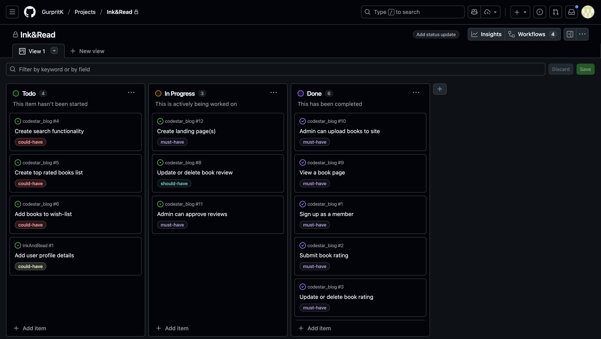

## Table Of Contents:
1. [About](#about)
2. [Design & Planning](#design-&-planning)
    * [User Stories](#user-stories)
    * [User Goals](#user-goals)
    * [Wireframes](#wireframes)
    * [Agile Methodology](#agile-methodology)
    * [Typography](#typography)
    * [Colour Scheme](#colour-scheme)
    * [Entity Relationship Diagram Diagram](#entity-relationship-diagram)    
    
3. [Features](#features)
    * [Navigation](#Navigation)
    * [Footer](#Footer)
    * [Home page](#Home-page)
    * [add your pages](#)
    * [CRUD](#CRUD)
    * [Authentication & Authorisation](#Authentication-Authorisation )

4. [Technologies Used](#technologies-used)
5. [Libraries](#libraries-used)
6. [Testing](#testing)
7. [Bugs](#bugs)
8. [Deployment](#deployment)
9. [Credits](#credits)

## About
[Back To The Top](#table-of-contents)

Ink&Read is a website for avid readers to be part of a vibrant community of readers. The members can view books available on the website, learn more about each book and see what the community members are rating and reviewing it. Members of the community can also submit their reviews for books, whilst non-members have view-only access to the ratings and reviews.

Admins can upload new books, approve reviews and create content for each book page, including details about the book. 

Members of the website can also create a wishlist for books they'd like to read or mark books as 'read'. In the member profile page, logged in users can view their wishlist and track the books they have read. Users can also see this on each individual book page whether they have previously added the book to their wishlist or marked that book as read. Admins can manage user profile lists, including the 'wishlist' and 'read' list.

## Design & Planning:
[Back To The Top](#table-of-contents)

### User Stories
Write your user stories in this section

  

  
GitHub Project User Stories

  
  
  

### User Goals

### Site Owner Goals
- Display a website with information on books
- Manage ratings and reviews for books
- Manage the About page
- Manage a list of highly rated books
- Create a responsive and intuitive design

### External Registered User Goals
- Read detailed book information
- Register for an account
- Log in securely
- Edit saved user details
- Submit reviews on books
- Edit and delete reviews
- Rate books using a star rating system
- Enquire/register for upcoming book events

### External Non-Registered User Goals
- Read detailed book information
- View reviews on books
- View ratings on books

### Wireframes

I  used [Balsamiq](https://balsamiq.com/) to make wireframes for different screen layouts for my website design, and created mockups for mobile screen and laptop/desktop screen users. The wireframes helped to create an initial vision of how the website would look and feel. The finished website took inspiration from the mockups and built on top of it, hence the final result may differ from the wireframes  constructed in the initial planning stages.

#### Mobile Wireframes

  

  
Home Page - Not Logged In

  
  
  

  

  
Home Page - Logged In

  
  
  

#### Laptop/Desktop Wireframes

  

  
Home Page - Not Logged In

  
  
  

  

  
Home Page - Logged In

  
  
  

   

  
My Profile - Logged In

  
  
  

  

### Agile Methodology
Explain your agile approach to your project and insert screenshoots of your Kanban board (itterations, user stories, tasks,acceptance criteria, labels, story points...)

The agile approach for my project was to create a kanban board to track the status of the issues for the project. Each issue was prioritised using the MoSCow labels (Must Have, Should Have, Could Have) to streamline the issues, and focus on completing the issues with higher priority first. Each issue correlated to a user story, with an acceptance criteria list of what it would require for each user story to be considered complete. 

The Kanban board was structured into three different stages:

- To Do
- In Progress
- Done

Link to the project [Kanban Board](https://github.com/users/GurpritK/projects/9/views/1) 

### Typography

For the logo and main headings of Ink&Read, I chose the Cedarville Cursive font. Its handwritten, flowing style evokes the warmth and personality of classic handwritten notes or vintage book inscriptions, giving the site a touch of literary charm and nostalgia.

For the body text and general content, I selected EB Garamond, a timeless serif typeface known for its elegance, readability, and historical connection to traditional print. Together, these two fonts create a balanced aesthetic — the cursive lends character and creativity, while Garamond ensures clarity and a polished, modern reading experience.

This pairing was carefully chosen after testing several options; the goal was to capture the feeling of an inviting library or cherished personal bookshelf, while maintaining a professional and accessible interface that supports effortless navigation and reading.

### Colour Scheme and Design Choices

I wanted to create a cosy library nook feeling on this virtual website and employed warm neutral tone colours and wooden textures to evoke this. The primary colours used were browns, and the font colours were creams and contrasted against the browns. I generated an AI image with prompts to bring my vision to life of a welcoming reading area for a community of readers, with elements of all those colours in one image to tie the website together.

I shifted the navbar to the left hand side of the page, rather than keep it at the top, to create the imagery of a bookshelf. By removing the navbar from the top, my aim was to create website which would feel less corporate.

The colour palette was generated using [Coolors](https://www.coolors.co).

  
Colour Palette

  
  
  

### Entity Relationship Diagram
I used [Eraser](https://www.eraser.io/ai/erd-generator) to create an Entity Relationship Diagram (ERD). The relationships between the tables are drawn. The About table is completely independent (they have no connection to any other table). A picture of the ERD is below.

  
Entity Relationship Diagram

  
  
  

## Features:
[Back To The Top](#table-of-contents)

Explain your features on the website,(navigation, pages, links, forms, input fields, CRUD....)
### Navigation

For larger screens like laptops and desktops, there is a fixed navbar on the left hand side of the website. The navbar is accessible and visible from all screens.

For smaller screens, like mobiles and tablets, there is a fixed navbar the the top of the screen with a hamburger icon for the menu dropdown. This navbar is accessible on all pages.

From the navbar, users can navigate to the book collection and their own profiles. If they are logged in, they have the link to 'log out'. If they are not signed in, the navbar updates to provide links to 'sign up' and 'log in'.

From the book collection page, users can navigate to individual books to read more about each book, as well as add ratings and reviews. Within each book page, the user can also add the book to a 'wishlist' or mark it as 'read'. 

Similarly, users can navigate to books from their own profile. 

### Footer
### Home-page
### CRUD

- Registered users can add a rating, update their rating and delete their rating for a book. When the user navigates the book page, they can also view the rating they submitted. When a user makes any of these changes, they are notified with an alert whether their action was successful. Each user is limited to one rating per book, and the option to 'update' their rating is available only.

- Registered users can create reviews, update their reviews and delete their reviews for a book. When the user submits or updates a review, it is sent for approval to the admin. The user is notified that their review has been submitted for approval. When a user deletes their review, this change is applied immediately and the review will no longer be seen on the page. All reviews from all users are visible on the book page. Each user is limited to one review per book, and the option to 'update' their review is available only.

- To personalise the user experience further, registered users can navigate to a book page and 'favourite' a book. This will add the book to their favourites collection in their personal profile section. Users can easily 'unfavourite' a book by toggling the favourites button. The change is reflected immediately on the book page too, and a heart icon is filled or unfilled depending on the action (assuming they are logged in). The user is notified for each action. This feature is available to logged in users only.

- Similarly, as part of the personalised user experience, registered users can navigate to a book page and mark the book as 'read'. This will add the book to their 'read' books collection in their personal profile section. Users can easily mark the same book as 'unread' by toggling the 'read' button. The change is reflected immediately on the book page, and an icon is filled or unfilled depending on the action (assuming they are logged in). The user is notified for each action. This feature is available to logged in users only.

### Authentication-Authorisation 

- Django AllAuth used...

Admin users, and registered user are authenticated? authorised?
Admin can remove users from the admin page.

## Technologies Used
[Back To The Top](#table-of-contents)

Used Gemini AI to generate hero image used on website homepage.

List of technologies used for your project

## Libraries 

## Testing
[Back To The Top](#table-of-contents)

Important part of your README!!!
### Google's Lighthouse Performance
Screenshots of certain pages and scores (mobile and desktop)
### Browser Compatibility
Check compatability with different browsers
### Responsiveness
Screenshots of the responsivness, pick few devices
### Code Validation
Validate your code HTML, CSS, JS & Python (all pages/files need to be validated!!!), display screenshots
### Manual Testing user stories
Test all your user stories, you an create table 
User Story |  Test | Pass
--- | --- | :---:
paste here you user story | what is visible to the user and what action they should perform | &check;
attach screenshot

### Manual Testing
The site was tested on the following browsers for compatibility:

### Chrome ###
|   Test	|  Expected Result 	|  Actual Result	|
|---	|---	|---	|
|   Click Home menu	|  success 	|  success 	|
|   Click About menu	|  success 	|  success 	|
|   Click Biogs menu	|  success 	|  success 	|
|   Click Admin menu	|  success 	|  success 	|
|   Click Login menu	|  success 	|  success 	|
|   Click Logout	|  success 	|  success 	|
|   Click individual blog post	|  success 	|  success 	|
|   Create, edit, delete a personal comment	|  success 	|  success 	|
|   Register new account	|  success 	|  success 	|
|   Create collaboration request	|  success 	|  success 	|
|   Access admin interface	|  success 	|  success 	|
|   Responsivity	|  success 	|  success 	|
|   Open new page from social media links	|  success 	|  success 	|

### Firefox ###
|   Test	|  Expected Result 	|  Actual Result	|
|---	|---	|---	|
|   Click Home menu	|  success 	|  success 	|
|   Click About menu	|  success 	|  success 	|
|   Click Biogs menu	|  success 	|  success 	|
|   Click Admin menu	|  success 	|  success 	|
|   Click Login menu	|  success 	|  success 	|
|   Click Logout	|  success 	|  success 	|
|   Click individual blog post	|  success 	|  success 	|
|   Create, edit, delete a personal comment	|  success 	|  success 	|
|   Register new account	|  success 	|  success 	|
|   Create collaboration request	|  success 	|  success 	|
|   Access admin interface	|  success 	|  success 	|
|   Responsivity	|  success 	|  success 	|
|   Open new page from social media links	|  success 	|  success 	|

### Edge ###
|   Test	|  Expected Result 	|  Actual Result	|
|---	|---	|---	|
|   Click Home menu	|  success 	|  success 	|
|   Click About menu	|  success 	|  success 	|
|   Click Biogs menu	|  success 	|  success 	|
|   Click Admin menu	|  success 	|  success 	|
|   Click Login menu	|  success 	|  success 	|
|   Click Logout	|  success 	|  success 	|
|   Click individual blog post	|  success 	|  success 	|
|   Create, edit, delete a personal comment	|  success 	|  success 	|
|   Register new account	|  success 	|  success 	|
|   Create collaboration request	|  success 	|  success 	|
|   Access admin interface	|  success 	|  success 	|
|   Responsivity	|  success 	|  success 	|
|   Open new page from social media links	|  success 	|  success 	|

### Safari ###
|   Test	|  Expected Result 	|  Actual Result	|
|---	|---	|---	|
|   Click Home menu	|  success 	|  success 	|
|   Click About menu	|  success 	|  success 	|
|   Click Biogs menu	|  success 	|  success 	|
|   Click Admin menu	|  success 	|  success 	|
|   Click Login menu	|  success 	|  success 	|
|   Click Logout	|  success 	|  success 	|
|   Click individual blog post	|  success 	|  success 	|
|   Create, edit, delete a personal comment	|  success 	|  success 	|
|   Register new account	|  success 	|  success 	|
|   Create collaboration request	|  success 	|  success 	|
|   Access admin interface	|  success 	|  success 	|
|   Responsivity	|  success 	|  success 	|
|   Open new page from social media links	|  success 	|  success 	|

### Lighthouse
The site was tested using Lighthouse with the following results:

### Responsive Testing

Alongside the built in Bootstrap responsive CSS, Chrome dev tools were used frequently to test the site at standard screen sizes and the site was manually viewed on laptops, tablets and phones.

### Validator Testing

- HTML

  - No errors were returned when passing through the official W3C validator

- CSS
  - No errors were found with our own CSS code when passing through the official Jigsaw validator.

- Python

  - All Python code was tested for PEP8 compatibility with the Code Institute Linter.

  **The only code that didn't pass was code that was automatically generated by Django**
  
  which was then edited in order to pass.

  

  - Javascript

  - All Javascript code was tested for errors with JSHint. There were no code errors and one error related to imported code, which is outside the domain of the test.
  
  

## Bugs
[Back To The Top](#table-of-contents)

List of bugs and how did you fix them
- I decided to rename an app from 'my_profile' to 'user_profiles' as this naming made more sense from the admin perspective when managing different user profiles. This involved creating the new app, moving models, views and existing templates across from the old app, and transferring any migration tables and data within the tables. 

Although the transfer of all these files and data, and deleting the old app was successful, the site was crashing with errors like 'not found'. When navigating to the profile page, there were errors referencing the old app. This suggested there were some stil some references to the old app remaining in the project. I looked through all the files, and eventually decided to lean on AI to find the remaining references and update them. Copilot AI was quick to identify that the URL paths in urls.py hadn't been updated. 

- I was making changes to the CSS files, but these were not appearing in the local web development browser. My initial thinking was that the CSS file was not properly connected to the html template files, and perhaps the script paths were incorrect but this was not the case. I did some further investigation to find what was missing (and a lot of hard refreshes!), AI also suggested some changes to make but I knew from my previous projects that the additional settings AI was recommending were not required. Finally, I found that the debug settings was set to FALSE (from my last commit to deploy the app to Heroku), hence the CSS was no longer showing on my local browser. Once I set it to TRUE, the CSS changes were immediately reflected in my local browser.

- When I deployed the app on Heroku, the styling was not being applied. I realised I had missed the step to deploy static files. The 'staticfiles' folder was missing from the project and some additional static file settings needed to be set in the settings.py folder. The whitenoise package had to be installed too. Finally, to collect static files I ran the collectstatic command in my terminal and these files were added to the base directory and folder name specifed when I set this in the settings.py using the STATIC_ROOT variable. 

- As I created more books for the book collection from the admin pages, by manually adding the book covers and details, I found that the display in the website was showing the HTML code within the descriptions for each book. This issue did not occur when I added the first book. By using 'safe' and 'striptags' tags in the HTML for book descriptions, I was able to fix this issue.

- I decided instead of a favourites list, I wanted to create a wishlist instead. I updated all the frontend code to reflect this in the text on the website, but since it used the same functionality in the backend code I decided to keep the model table the same, and keep the field 'is_favourite' to use for the wishlist. I could've updated the table, and migrated once and transferred existing data but since there was no fundamental change to the backend functionality, it made sense to keep the table name as is.

## Deployment
[Back To The Top](#table-of-contents)

This website is deployed to Heroku from a GitHub repository, the following steps were taken:

#### Creating Repository on GitHub
- First make sure you are signed into [Github](https://github.com/) and go to the code institutes template, which can be found [here](https://github.com/Code-Institute-Org/gitpod-full-template).
- Then click on **use this template** and select **Create a new repository** from the drop-down. Enter the name for the repository and click **Create repository from template**.
- Once the repository was created, I clicked the green **gitpod** button to create a workspace in gitpod so that I could write the code for the site.

#### Creating an app on Heroku
- After creating the repository on GitHub, head over to [heroku](https://www.heroku.com/) and sign in.
- On the home page, click **New** and **Create new app** from the drop down.
- Give the app a name(this must be unique) and select a **region** I chose **Europe** as I am in Europe, Then click **Create app**.

#### Create a database 
- Log into [CIdatabase maker](https://www.heroku.com/](https://dbs.ci-dbs.net/))
- add your email address in input field and submit the form
- open database link in your email
- paste dabase URL in your DATABASE_URL variable in env.py file and in Heroku config vars

#### Deploying to Heroku.
- Head back over to [heroku](https://www.heroku.com/) and click on your **app** and then go to the **Settings tab**
- On the **settings page** scroll down to the **config vars** section and enter the **DATABASE_URL** which you will set equal to the elephantSQL URL, create **Secret key** this can be anything,
**CLOUDINARY_URL** this will be set to your cloudinary url and finally **Port** which will be set to 8000.
- Then scroll to the top and go to the **deploy tab** and go down to the **Deployment method** section and select **Github** and then sign into your account.
- Below that in the **search for a repository to connect to** search box enter the name of your repository that you created on **GitHub** and click **connect**
- Once it has been connected scroll down to the **Manual Deploy** and click **Deploy branch** when it has deployed you will see a **view app** button below and this will bring you to your newly deployed app.
- Please note that when deploying manually you will have to deploy after each change you make to your repository.
## Credits
[Back To The Top](#table-of-contents)

* Gemini AI for hero image generation 
* Google Images and Amazon for book cover photos
* Goodreads for book descriptions
* Eraser.io for ERD 
* Copilot AI with development, testing and debugging assistance with the project
* Coolors.co for colour palette selection
* Miro board by Marko Tot for comprehensive and helpful tools, lists, guides, project examples and tutorial videos
* Django Setup & Deployment Guidebook 2025 by CodeInstitute [link here](https://docs.google.com/document/d/16UKi7H0DSL2ih-OSz_VixomKxY2wp1DIoGUO8EZaRyU/edit?tab=t.0#heading=h.5s9novsydyp1)
* Django cheat sheet [link here](https://codeinstitute.s3.eu-west-1.amazonaws.com/PDF/Django%2BCheat%2BSheet.pdf)
* Bootstrap5 to create responsive designs and layouts
* Google Fonts for fonts used within website
* FontAwesome for icons used within website
* All the shared projects on GitHub to guide the project including code file structuring, and readme.md structuring
* YouTube tutorial for implementing review and rating systems [link here](https://www.youtube.com/watch?v=Zkmu93lMLPs)

List of used resources for your website (text, images, snippets of code, projects....)