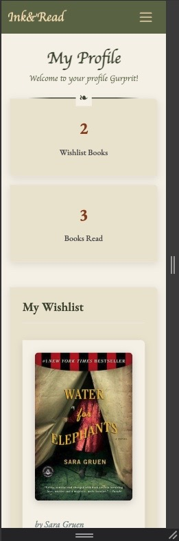

# Ink&Read
## Table Of Contents:
1. [About](#about)
2. [Design & Planning](#design--planning)
    * [User Goals](#user-goals)
    * [User Stories](#user-stories)
    * [Wireframes](#wireframes)
    * [Agile Methodology](#agile-methodology)
    * [Typography](#typography)
    * [Colour Scheme](#colour-scheme-and-design-choices)
    * [Entity Relationship Diagram](#entity-relationship-diagram)    
    
3. [Features](#features)
    * [Navigation](#navigation)
    * [Footer](#footer)
    * [Home Page](#home-page)
    * [Book Collection Page](#book-collection-page)
    * [Book Detail Page](#book-detail-page)
    * [User Profile Page](#user-profile-page)
    * [CRUD](#crud)
    * [Authentication & Authorisation](#authentication-authorisation)

4. [Technologies Used](#technologies-used)
5. [Testing](#testing)
6. [Bugs](#bugs)
7. [Deployment](#deployment)
8. [AI Reflection](#ai-reflections)
9. [Credits](#credits)

## About
[Back To The Top](#table-of-contents)

Ink&Read is a website for avid readers to be part of a vibrant community of readers. The members can view books available on the website, learn more about each book and see what the community members are rating and reviewing it. Members of the community can also submit their reviews for books, whilst non-members have view-only access to the ratings and reviews.

Admins can upload new books, approve reviews and create content for each book page, including details about the book. 

Members of the website can also create a wishlist for books they'd like to read or mark books as 'read'. In the member profile page, logged in users can view their wishlist and track the books they have read. Users can also see this on each individual book page whether they have previously added the book to their wishlist or marked that book as read. Admins can manage user profile lists, including the 'wishlist' and 'read' list.

## Design & Planning:
[Back To The Top](#table-of-contents)

### User Goals

#### Site Owner Goals
- Display a website with information on books
- Manage ratings and reviews for books
- Manage a list of highly rated books
- Create a responsive and intuitive design

#### External Registered User Goals
- Read detailed book information
- Register for an account
- Log in securely
- Edit saved user details
- Submit reviews on books
- Update and delete reviews
- Rate books using a star rating system

#### External Non-Registered User Goals
- Read detailed book information
- View reviews on books
- View ratings on books
- View the featured book of the week

### User Stories

Link to the project [GitHub Project/User Stories Board](https://github.com/users/GurpritK/projects/9/views/1) 

  

  
GitHub Project User Stories

  
  
  

#### User Stories List

| User Story | Description |
|:-----------|:------------|
| Admin can upload books to site | As an admin, I can add new books to the website so that users can discover and read about them |
| View a book page | As a user, I can view detailed information about a book including its description, ratings, and reviews |
| Create landing page(s) | As a user, I can access a welcoming homepage that introduces me to the site's features |
| Sign up as a member | As a visitor, I can create an account to access member-only features |
| Submit book rating | As a registered user, I can rate books to share my opinion with the community |
| Update or delete book rating | As a registered user, I can modify or remove my ratings |
| Create search functionality | As a user, I can search for books to find specific titles or authors |
| Create top rated books list | As a user, I can see which books are most highly rated by the community |
| Add books to wish-list | As a registered user, I can save books to my wishlist for future reading |
| Submit book review | As a registered user, I can write detailed reviews of books |
| Update or delete book review | As a registered user, I can edit or remove my reviews |
| Admin can approve reviews | As an admin, I can moderate reviews before they appear on the site |
| Add user profile details | As a registered user, I can manage my profile and track my reading activity |

### Wireframes

I  used [Balsamiq](https://balsamiq.com/) to make wireframes for different screen layouts for my website design, and create mockups for mobile screen and laptop/desktop screen users. The wireframes helped to create an initial vision of how the website would look and feel. The finished website took inspiration from the mockups and built on top of it, hence the final result may differ from the wireframes constructed in the initial planning stages.

#### Mobile Wireframes

  

  
Home Page - Not Logged In

  
  
  

  

  
Home Page - Logged In

  
  
  

#### Laptop/Desktop Wireframes

  

  
Home Page - Not Logged In

  
  
  

  

  
Home Page - Logged In

  
  
  

   

  
My Profile - Logged In

  
  
  

  

### Agile Methodology

The agile approach for my project was to create a kanban board to track the status of the issues for the project. Each issue was prioritised using the MoSCow labels (Must Have, Should Have, Could Have) to streamline the issues, and focus on completing the issues with higher priority first. Each issue correlated to a user story, with an acceptance criteria list of what it would require for each user story to be considered complete. 

The Kanban board was structured into three different stages:

- To Do
- In Progress
- Done

Link to the project [Kanban Board](https://github.com/users/GurpritK/projects/9/views/1) 

### Typography

For the logo and main headings of Ink&Read, I chose the Cedarville Cursive font. Its handwritten, flowing style evokes the warmth and personality of classic handwritten notes or vintage book inscriptions, giving the site a touch of literary charm and nostalgia.

For the body text and general content, I selected EB Garamond, a timeless serif typeface known for its elegance, readability, and historical connection to traditional print. Together, these two fonts create a balanced aesthetic — the cursive lends character and creativity, while Garamond ensures clarity and a polished, modern reading experience.

This pairing was carefully chosen after testing several options; the goal was to capture the feeling of an inviting library or cherished personal bookshelf, while maintaining a professional and accessible interface that supports effortless navigation and reading.

### Colour Scheme and Design Choices

The design strategy focused on creating a welcoming literary environment through careful color selection and layout decisions. The primary color palette uses muted greens with soft yellows and browns to establish a warm, library-inspired aesthetic.

The custom hero image reinforces the community reading theme and establishes visual consistency throughout the site. All color choices support the goal of creating an inviting space for book enthusiasts.

A key design decision involved relocating the navigation from the traditional top position to a left sidebar. This approach creates a more personal browsing experience while reducing the corporate feel commonly associated with standard web layouts.

The initial color palette was developed using [Coolors](https://www.coolors.co), though the final implementation evolved to incorporate additional yellow tones and warmer variations that better suited the literary theme.

  
Colour Palette

  
  
  

### Entity Relationship Diagram
I used [Eraser](https://www.eraser.io/ai/erd-generator) to create an Entity Relationship Diagram (ERD). The relationships between the tables are drawn. 

  
Entity Relationship Diagram

  
  
  

### Model Descriptions

#### User (Django's Built-in)
- **Purpose**: Manages user authentication and basic profile information
- **Key Features**: Username, email, authentication fields
- **Relationships**: Central entity connected to all user-generated content

#### Book
- **Purpose**: Stores book information including metadata and cover images
- **Key Features**: 
  - Unique title and slug for SEO-friendly URLs
  - Cloudinary integration for cover image storage
  - Author information and rich text descriptions
- **Methods**: `average_rating()`, `is_favorited_by()`, `is_read_by()`

#### BookRating
- **Purpose**: Stores user ratings for books (1-5 stars)
- **Key Features**:
  - One rating per user per book (unique constraint)
  - Timestamp tracking for creation and updates
  - Validation for score range (1-5)
- **Related Name**: `ratings` (accessible via `book.ratings.all()`)

#### BookReview
- **Purpose**: Stores detailed user reviews for books
- **Key Features**:
  - One review per user per book (unique constraint)
  - Admin approval system with `approved` flag
  - Rich text content support
- **Related Names**: `reviewer` (user), `reviewed_book` (book)

#### UserBookList
- **Purpose**: Manages user's personal book library and reading status
- **Key Features**:
  - Favorite and read status tracking
  - Personal notes for each book
  - Timestamp tracking for library management

## Features:
[Back To The Top](#table-of-contents)

Screenshots of features below:

### Navigation

For larger screens like laptops and desktops, there is a fixed navbar on the left hand side of the website. The navbar is accessible and visible from all screens:

  
Homepage Navbar

  
  
  

For smaller screens, like mobiles and tablets, there is a fixed navbar the the top of the screen with a hamburger icon for the menu dropdown. This navbar is accessible on all pages:

  
Mobile Navbar

  
  
  

From the navbar, users can navigate to the book collection and their own profiles. If they are logged in, they have the menu option to 'log out'. If they are not signed in, the navbar updates to provide menu options to 'sign up' and 'log in':

  
Smart Navbar

  
  
  

### Footer

In the footer, there are some quick links to the homepage, and the book collection page. There is a small description about the Ink&Read website, and social media links. Currently there are empty links which simply navigate to the hompages of the social media websites. 

  
Footer

  
  
  

### Home-Page

The homepage displays a beautiful and inviting hero image which creates a warm, welcoming inviting for readers. Here you have some CTA buttons to 'explore books' or 'sign up' or 'log in':

  
Buttons Logged Out

  
  
  

The 'sign up' and 'log in'  buttons are removed and replaced if the user is logged in to a 'log out' button:

  
Buttons Logged In

  
  
  

Below the hero section, there is more information about the site and everything you can use the site for. This information is split and displayed in a grid for an easier to digest format:

  
About Grid

  
  
  

Near the bottom of the homepage, there is a section for 'book of the week' which updates according to the most recent highly rated book:

  
Featured Book

  
  
  

### Book-Collection-Page

The book collection page displays all the book included in the website in a grid display. Within each book grid/card, the book cover, book title, a truncated description of the book and author name is visible:

  
Book Collection Grid

  
  
  

Additionally, a rating display for each book is also visible:

  
Individual Book Rating

  
  
  

If a book has no ratings, this is also shown in the book card:

  
Individual Book No Rating

  
  
  

Logic is applied to calculate and display the average rating score for each book in the individual book card. It is possible to click on any book, and navigate to the book details page.

### Book-Detail-Page

The book detail page is where you can see the full description of each book, book cover and also the other details like author and title:

  
Book Details

  
  
  

On this page, you will find the average rating of a book and reviews left by other users:

  
Book Detail Average Rating

  
  
  

Logged in users can also give a rating and submit a review. If the logged in user has previously submitted either a review or rating, it can also be updated or deleted from this page:

  
Submit Rating or Review

  
  
  

 
The reviews are only displayed after approval:

  
Review Approval Message

  
  
  

On this page, logged in users can add a book to their own wishlist, or mark a book as read:

  
List Buttons

  
  
  

For logged out users, you can see everything linked to the book but cannot add reviews or ratings, or add the book to a wishlist or mark it as 'read'. In the space of where these buttons are available for logged in users, there is instead a message to 'log in' to 'complete action', where the action represents either of those fuctionalities.

  
Limited Functionality

  
  
  

### User-Profile-Page

Logged in users have their own member area, which they can navigate to directly from the navbar:

  
Profile Area

  
  
  

The link is personalised with the user's name e.g. "Gurprit's Profile":

  
Personalised Message

  
  
  

There is also a number tracker for their lists:

  
List Number Tracker

  
  
  

Within the user profile, members can view their wishlist of books:

  
Wishlist

  
  
  

 
They can also track their reading by viewing books they have marked as 'read':

  
Read List

  
  
  

 
 If there are no books in either list, there is CTA button to 'browse books' so that they can start curating their lists:

 

  
No Books in List

  
  
  

**Future Improvement:** This profile area can be further improved in the future by allowing users to directly manage their lists from this page. However, they can make changes to their lists by clicking on a book from the profile area, and toggling the 'add to wishlist' or 'mark as read' buttons. This change will automatically update and reflect in the user profile page.

### CRUD

- Registered users can add a rating, update their rating and delete their rating for a book. When the user navigates the book page, they can also view the rating they submitted. When a user makes any of these changes, they are notified with an alert whether their action was successful. Each user is limited to one rating per book, and the option to 'update' their rating is available if a rating has already been submitted.

- Registered users can create reviews, update their reviews and delete their reviews for a book. When the user submits or updates a review, it is sent for approval to the admin. The user is notified that their review has been submitted for approval. When a user deletes their review, this change is applied immediately and the review will no longer be seen on the page. All reviews from all users are visible on the book page. Each user is limited to one review per book, and the option to 'update' their review is available only.

- To personalise the user experience further, registered users can navigate to a book page and 'add to wishlist'. This will add the book to their wishlist in their personal profile page. Users can easily remove a book from their wishlist by toggling the button on the book page. The change is reflected immediately on the book details page and in the user profile page too. The user is notified for each action. This feature is available to logged in users only.

- Similarly, as part of the personalised user experience, registered users can navigate to a book page and mark the book as 'read'. This will add the book to their 'read' books collection in their personal profile section. Users can easily mark the same book as 'unread' by toggling the 'read' button on the book details page. The change is reflected immediately on the book page. The user is notified for each action. This feature is available to logged in users only.

### Authentication-Authorisation

User authentication is handled through Django AllAuth, providing secure and reliable user management. The standard sign-up, login, and logout pages have been styled to match the site's cozy aesthetic.

Users can easily create accounts to unlock member features like rating books, writing reviews, and building personal reading lists. For site administrators, Django's admin panel provides full control over user accounts and content moderation, keeping the community friendly and spam-free. 

## Technologies Used
[Back To The Top](#table-of-contents)

List of technologies used for your project

### Languages

* Python
* Django
* HTML
* CSS
* JavaScript

### Frameworks, Libraries, and Tools

* **Django**: The main web framework used for building the application
* **Bootstrap**: For responsive design and styling
* **AllAuth**: For user authentication
* **Crispy Forms**: For all forms
* **Heroku**: For application deployment
* **Git**: For version control
* **Visual Studio Code** For code development and local testing
* **Cloudinary**: Dynamic assets hosting (images)
* **Favicon.io**: For manifest and favicon creation
* **Balsamiq**: Wireframes creation
* **Fontawesome** Social media icons (Facebook, Instagram, X and Youtube)
* **Google Fonts** Import fonts to CSS

### AI tools
* **Gemini** : AI image generation
* **ChatGPT** : Coding with Django research 
* **Eraser.io** : ERD generation
* **Copilot** : Code development and debugging assistance

## Testing
[Back To The Top](#table-of-contents)

### Testing tools
- [HTML Validator](https://validator.w3.org/nu/) - Used to validate the HTML files.
- [CSS Validator](https://jigsaw.w3.org/css-validator/) - Used to validate the CSS code.
- [JShint](https://jshint.com/) - Used to validate the JavaScript code.
- [CI Python Linted](https://pep8ci.herokuapp.com/) - Used to validate Python code.
- Chrome Developer Tools - Lighthouse reports, template responsiveness

### Google's Lighthouse Performance
Screenshots of desktop and mobile lighthouse reports for homepage, books page and profile page.

  
Homepage Desktop Lighthouse Report

  
  
  

  
Homepage Mobile Lighthouse Report

  
  
  

  

  
Book Collection Desktop Lighthouse Report

  
  
  

  
Book Collection Mobile Lighthouse Report

  
  
  

  

  
Profile Page Desktop Lighthouse Report

  
  
  

  
Profile Page Mobile Lighthouse Report

  
  
  

### Browser Compatibility

Compatability check with different browsers

| Browser | Status | 
|:-------:|:--------| 
| Google Chrome | Success |
| Safari | Success |
| Firefox | Success |

### Responsiveness
Responsiveness tested using Chrome Developer Tools, and testing different dimensions.

Screenshots of the responsiveness for mobile, tablet and desktop for the **homepage**:

  
Homepage Desktop Screen

  
  
  

 

  
Homepage Tablet Screen

  
  
  

  
Homepage Mobile Screen

  
  
  

Screenshots of the responsiveness for mobile, tablet and desktop for the **books** page:

  
Books Desktop Screen

  
  
  

 

  
Books Tablet Screen

  
  
  

  
Books Mobile Screen

  
  
  

Screenshots of the responsiveness for mobile, tablet and desktop for the **profile** page:

  
Profile Desktop Screen

  
  
  

 

  
Profile Tablet Screen

  
  
  

  
Profile Mobile Screen

  
  
  

### Code Validation
HTML, CSS, JS & Python Code Validations

  

  
HTML Validation Screenshot

  
  
  

  
CSS Validation Screenshot

  
  
  

Python Validation

Python (PEP8) Validation using [CI Python Linted](https://pep8ci.herokuapp.com/) and Flake8 in local development environment:
All .py files validated with only two python files remaining showing minimal warnings. All other python files in project validated successfully.

Outstanding Warnings:

A specific error for unused env import in settings.py. It's safe to leave it as it, and it doesn't impact the functionality.

There are still minor warnings related to line too long (greater than 79 characters) in models.py and settings.py, but these do not affect the functionality of the project, so leaving as is for now.

JavaScript Validation

Minimal custom JavaScript in project, three small instances only. No errors or warnings using [JShint](https://jshint.com/).

### Manual Testing user stories

All user stories have been manually tested to ensure they meet their acceptance criteria:

| User Story | Test Result |
|:-----------|:-----------:|
| Admin can upload books to site | ✅ Success |
| View a book page | ✅ Success |
| Create landing page(s) | ✅ Success |
| Sign up as a member | ✅ Success |
| Submit book rating | ✅ Success |
| Update or delete book rating | ✅ Success |
| Create search functionality | Did not implement |
| Create top rated books list | Did not implement |
| Add books to wish-list | ✅ Success |
| Submit book review | ✅ Success |
| Update or delete book review | ✅ Success |
| Admin can approve reviews | ✅ Success |
| Add user profile details | Did not implement|

## Bugs
[Back To The Top](#table-of-contents)

The following issues were encountered during development and their respective solutions:

**App Renaming Issues**
Renaming the 'my_profile' app to 'user_profiles' for improved clarity resulted in 'not found' errors despite successful file migration. Investigation revealed remaining references to the old app name in urls.py that required manual updating.

**CSS Loading Problems in Development**
CSS changes were not reflecting in the local development environment. The issue was traced to the DEBUG setting being set to FALSE (from a previous Heroku deployment), which prevented proper static file serving in development mode.

**Static Files Deployment Issues**
Styling appeared correctly in development but failed to load on Heroku deployment. The issue was resolved by implementing proper static file collection using `collectstatic` command and configuring WhiteNoise for static file serving.

**HTML Rendering in Book Descriptions**
Raw HTML code appeared in book descriptions when content was added through the admin interface. This was resolved by implementing Django's `striptags` template filter to properly render text content while preserving formatting capability in the admin.

**Database Field Naming Convention**
The frontend terminology was updated from "favorites" to "wishlist" for improved user experience, while maintaining the existing `is_favorite` database field name to avoid complex migrations and data loss.

**Responsive Layout Issues**
The "book of the week" section displayed incorrectly on mobile devices due to horizontal layout constraints. This was addressed through CSS media queries and proper Bootstrap grid implementation for responsive design.

### Future Improvements

**Form Input Styling Consistency**
The rating stars input maintains a default blue outline that does not conform to the custom styling applied to other form elements. This styling inconsistency could be addressed with additional CSS specificity.

## Deployment
[Back To The Top](#table-of-contents)

This website is deployed to Heroku from a GitHub repository using the following process:

#### Creating Repository on GitHub
- Sign into [GitHub](https://github.com/)
- Create a new repository with an appropriate name
- Copy the provided code to connect the GitHub repository to your local environment
- Link the repository to your local development environment

#### Creating an app on Heroku
- Sign into [Heroku](https://www.heroku.com/)
- Click **New** and select **Create new app** from the dropdown
- Enter a unique app name and select your region
- Click **Create app**

#### Create a database
- Access the [CI Database Maker](https://dbs.ci-dbs.net/)
- Submit your email address in the input field
- Open the database link provided in your email
- Copy the database URL to your DATABASE_URL variable in both env.py and Heroku config vars

#### Deploying to Heroku
- Navigate to your Heroku app and select the **Settings** tab
- Scroll to the **Config Vars** section and add:
  - **DATABASE_URL**: Set to the Code Institute URL provided
  - **SECRET_KEY**: Generate a secure secret key
  - **CLOUDINARY_URL**: Set to your Cloudinary URL
- Navigate to the **Deploy** tab
- Select **GitHub** as the deployment method and sign into your account
- Search for your repository name and click **Connect**
- Scroll to **Manual Deploy** and click **Deploy Branch**
- Once deployment completes, click **View App** to access your deployed application
- Note: Manual deployment requires redeployment after each repository change

## AI Reflections
[Back To The Top](#table-of-contents)

AI tools were utilized throughout this project to enhance development efficiency and code quality. The following outlines how AI assistance contributed to Ink & Read:

**Foundation Development**
GitHub Copilot provided assistance during initial setup, helping structure Django views, models, and templates. The AI identified inconsistencies and suggested appropriate fixes when issues arose during development.

**Design & Styling Implementation**
AI assistance was particularly effective in creating custom authentication and 404 error pages. By providing the existing color scheme and design patterns to Copilot, it generated consistent pages that maintained design cohesion across the site.

**Mobile Layout Resolution**
AI assistance proved valuable for responsive design challenges, particularly the mobile "book of the week" section. The AI translated DevTools observations into effective CSS solutions, streamlining the debugging process.

**Code Quality Assurance**
AI served as a quality control assistant, identifying redundant code, locating forgotten comment blocks, and catching missing HTML tags. This assistance significantly reduced time spent during testing validation phases.

**Deployment Troubleshooting**
When local styling failed to appear on Heroku, AI quickly identified the missing `collectstatic` step. The AI's systematic approach helped resolve deployment issues efficiently.

## Credits
[Back To The Top](#table-of-contents)

* Gemini AI for hero image generation 
* Google Images and Amazon for book cover photos
* Goodreads for book descriptions
* Eraser.io for ERD generation
* Copilot AI with development, testing and debugging assistance with the project
* Coolors.co for ready-made colour palettes
* Miro board by Marko Tot for comprehensive and helpful tools, lists, guides, project examples and tutorial videos
* Django Setup & Deployment Guidebook 2025 by CodeInstitute [link here](https://docs.google.com/document/d/16UKi7H0DSL2ih-OSz_VixomKxY2wp1DIoGUO8EZaRyU/edit?tab=t.0#heading=h.5s9novsydyp1)
* Django cheat sheet [link here](https://codeinstitute.s3.eu-west-1.amazonaws.com/PDF/Django%2BCheat%2BSheet.pdf)
* Bootstrap5 documentation to create responsive designs and layouts
* Google Fonts for fonts used within website
* FontAwesome for icons used within website
* All the shared projects on GitHub to guide the project including code file structuring, and readme.md structuring including [BookWormsPlace](https://github.com/AlexandraH-code/ms3-thebookwormsplace)
* YouTube tutorial for implementing review and rating systems [link here](https://www.youtube.com/watch?v=Zkmu93lMLPs)
